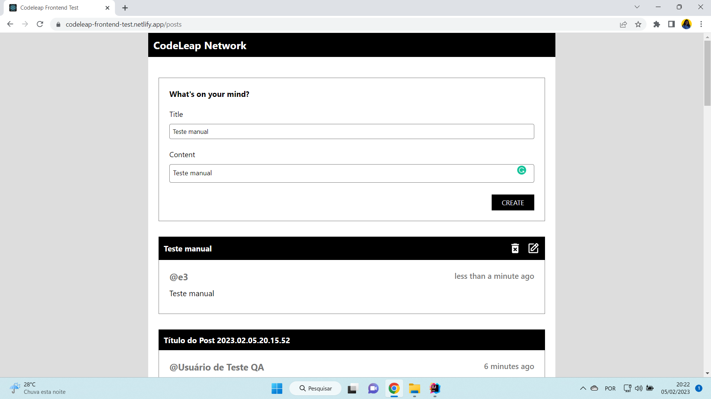
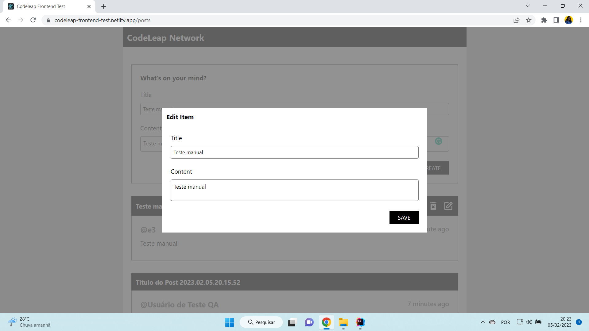
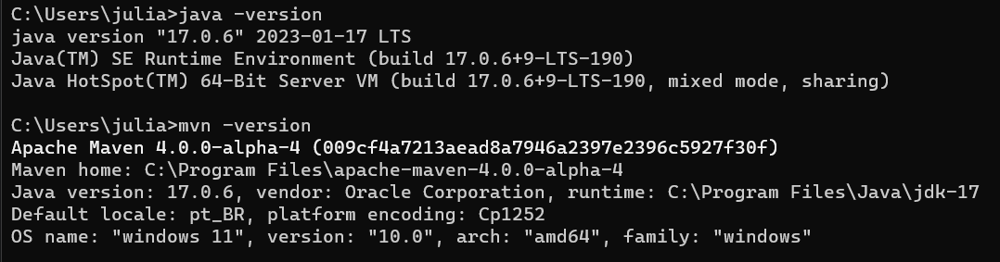

# RELATÓRIO DE RESUMO DE TESTE
- **Data:** 05 de Fevereiro de 2023
- **Projeto:** CodeLeap test 1
- **Versão do software:** versão do site https://codeleap-frontend-test.netlify.app/login encontrado em 05 de Fevereiro de 2023
- **Responsável pelo teste:**  [Júlia Tomé](https://github.com/juliatomeds)


### **Objetivo:**
- O objetivo deste relatório é fornecer uma visão geral dos resultados dos testes realizados no software.


### **Resultados:**
- **Total de casos de teste automatizados:** 3
- **Total de casos de teste manuais:** 8
- **Casos de teste bem-sucedidos:** 10
- **Casos de teste com falhas:** 1


### **Detalhes:**
- @CT10 Fluxo Manual - ❌ Reprovado, modal Delete Alert diferente do desenvolvido no Figma


### **Recomendações:**
- Limpeza de formulário após o envio nos casos de criação.



- Adicionar um botão de Cancelar para sair da tela de edição


### **Requerimentos:**
``` bash
java -version
mvn -version
``` 
- A resposta deve ser do tipo:

- Se precisar baixe o [Java](https://www.oracle.com/java/technologies/downloads/#jdk17-windows)
- Se o mvn não tiver sido reconhecido siga essas [instruções](https://www.youtube.com/watch?v=-ucX5w8Zm8s)

- Precisa adicionar as [dependências do Cucumber JAVA](https://mvnrepository.com/artifact/io.cucumber/cucumber-java)
- Precisa adicionar as [dependências do Cucumber TestNG](https://mvnrepository.com/artifact/io.cucumber/cucumber-testng)
- Depois vai no arquivo "pom.xlm" e clica com o botão direito em Maven -> Reload Project
- Depois vai em File -> Settings -> Plugins -> Baixa "Gherkin" e "Cucumber +" e "Create TestNG XML"

### **Maven:**
``` bash
mvn clean install
```